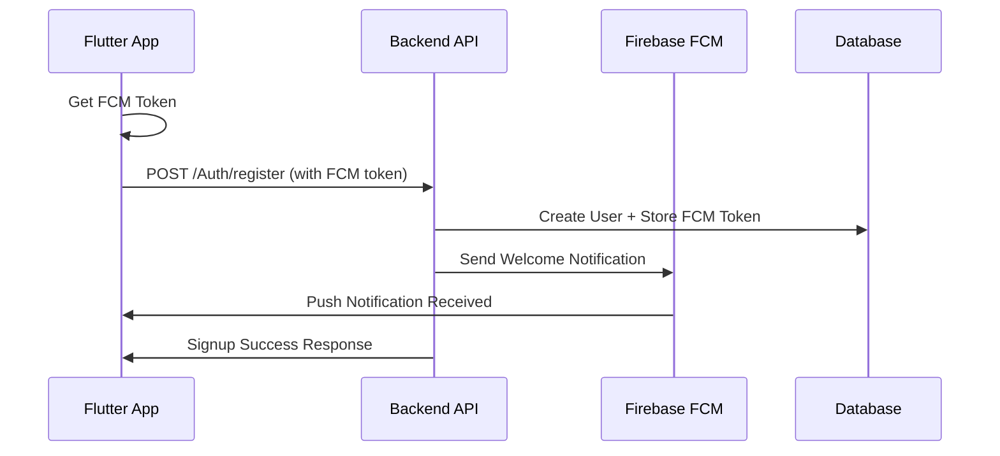
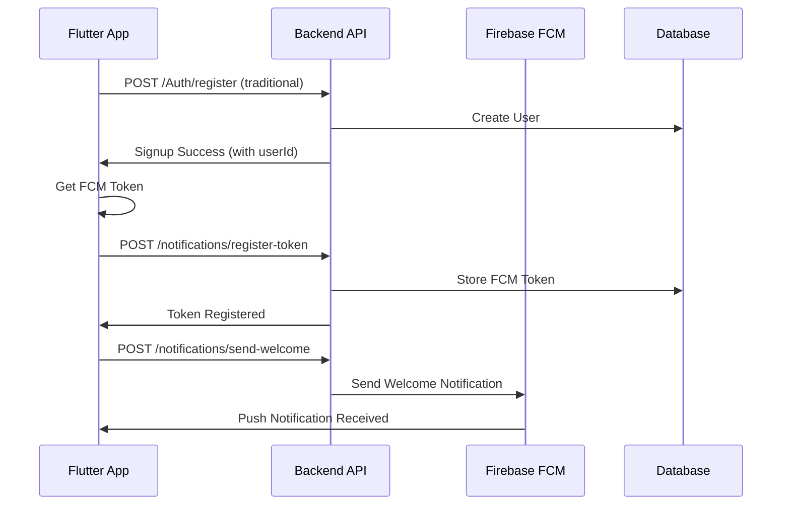

# 🔥 FCM Implementation Guide - Flutter to Backend

## 📊 2 Approaches để implement FCM

### 🚀 **APPROACH 1: Integrated (Recommended)**
```
📱 Signup Request → 🔑 Include FCM Token → 🖥️ Backend creates user + stores token + sends notification
```

**Ưu điểm:**
- ✅ Một API call duy nhất
- ✅ Atomic operation (user + FCM token)
- ✅ Ngay lập tức gửi welcome notification
- ✅ Đơn giản hơn cho frontend

**Nhược điểm:**
- ⚠️ Backend phải modify existing signup API
- ⚠️ Phụ thuộc vào FCM token availability

### 🔄 **APPROACH 2: Separate**
```
📱 Signup → 🖥️ Create user → 📱 Register FCM token → 🖥️ Store token → 📱 Request welcome notification
```

**Ưu điểm:**
- ✅ Tách biệt concerns
- ✅ Không cần modify existing signup API
- ✅ Flexible - có thể register token sau
- ✅ Fallback nếu FCM fail

**Nhược điểm:**
- ⚠️ Multiple API calls
- ⚠️ Phức tạp hơn
- ⚠️ Race conditions có thể xảy ra

---

## 🛠️ Current Implementation (Approach 1)

### Flutter Side (Current):
```dart
// lib/features/Auth/bloc/auth_bloc.dart
Future<bool> _signupWithFCMIntegrated(AuthSignupEvent event) async {
  // Use NotificationService to handle signup with FCM token
  final success = await notificationService.sendTokenDuringSignup(
    email: event.email,
    username: event.username,
    password: event.password,
  );
  return success;
}
```

### Backend Requirements (Need to implement):
```javascript
// POST /Auth/register
{
  "email": "user@example.com",
  "userName": "John Doe", 
  "password": "password123",
  "fcmToken": "fcm_token_here",           // ← NEW
  "sendWelcomeNotification": true         // ← NEW
}

// Response:
{
  "success": true,
  "message": "Signup successful!",
  "data": {
    "user": { "id": "user_id", "email": "...", ... },
    "token": "jwt_token_here"
  }
}
```

---

## 🔄 How to Switch to Approach 2

### 1. Update AuthBloc:
```dart
// In _onAuthSignupEvent method, uncomment this line:
// final success = await _signupWithFCMSeparate(event);

// And comment this line:
final success = await _signupWithFCMIntegrated(event);
```

### 2. Uncomment the separate method:
```dart
/// 🔥 APPROACH 2: Separate Signup then FCM Registration
Future<bool> _signupWithFCMSeparate(AuthSignupEvent event) async {
  // Step 1: Traditional signup
  final success = await signUpUseCase(event.email, event.password, event.username);
  
  if (!success) return false;

  // Step 2: Get userId from signup response (need to modify SignUpUseCase)
  final userId = 'user_id_from_signup_response'; 
  
  // Step 3: Register FCM token
  final fcmRegistered = await notificationService.registerFCMToken(userId: userId);
  
  // Step 4: Send welcome notification
  if (fcmRegistered) {
    await notificationService.sendWelcomeNotification(
      email: event.email,
      username: event.username,
    );
  }
  
  return true;
}
```

### 3. Backend APIs needed for Approach 2:
```javascript
// 1. Traditional signup (existing)
POST /Auth/register
{
  "email": "user@example.com",
  "userName": "John Doe",
  "password": "password123"
}

// 2. Register FCM token (new)
POST /notifications/register-token
{
  "userId": "user_id_here",
  "fcmToken": "fcm_token_here"
}

// 3. Send welcome notification (new)
POST /notifications/send-welcome
{
  "email": "user@example.com",
  "userName": "John Doe"
}
```

---

## 🎯 Flow Diagrams

### Approach 1 (Current):


### Approach 2:


---

## 📱 Testing FCM Flow

### 1. Test FCM Token Generation:
```dart
// Add this to test FCM token
void testFCMToken() async {
  final notificationService = serviceLocator<NotificationService>();
  final token = await notificationService.getFCMToken();
  print('🔑 FCM Token: $token');
}
```

### 2. Test Notification Manually:
1. Copy FCM token từ console log
2. Đi đến [Firebase Console](https://console.firebase.google.com)
3. Cloud Messaging → Send your first message
4. Paste token và send test notification

### 3. Test Backend API:
```bash
# Test signup with FCM (Approach 1)
curl -X POST http://your-backend-url/Auth/register \
  -H "Content-Type: application/json" \
  -d '{
    "email": "test@example.com",
    "userName": "Test User",
    "password": "password123",
    "fcmToken": "your_fcm_token_here",
    "sendWelcomeNotification": true
  }'
```

---

## 🔧 Troubleshooting Common Issues

### 1. FCM Token null:
```dart
// Check permissions first
NotificationSettings settings = await messaging.requestPermission();
if (settings.authorizationStatus == AuthorizationStatus.authorized) {
  String? token = await messaging.getToken();
}
```

### 2. Notification not received:
- Check if app is in foreground/background
- Verify FCM token is valid
- Check Firebase Console logs
- Ensure device has internet connection

### 3. Backend Firebase Admin setup:
```javascript
// Verify service account key
const admin = require('firebase-admin');
const serviceAccount = require('./firebase-service-account-key.json');

admin.initializeApp({
  credential: admin.credential.cert(serviceAccount),
});

// Test sending
const message = {
  token: 'fcm_token_here',
  notification: { title: 'Test', body: 'Test notification' }
};

admin.messaging().send(message)
  .then(response => console.log('✅ Sent:', response))
  .catch(error => console.error('❌ Error:', error));
```

---

## 🚀 Next Steps

### Immediate (Backend):
1. **Choose approach** (Recommend Approach 1)
2. **Setup Firebase Admin SDK** on backend
3. **Modify signup API** to handle FCM token
4. **Test end-to-end flow**

### Optional Enhancements:
1. **Topic subscriptions** (news, updates, etc.)
2. **Scheduled notifications** 
3. **Rich notifications** (images, actions)
4. **Notification analytics**
5. **Multi-device support**

### Production Considerations:
1. **Error handling** for invalid tokens
2. **Rate limiting** notification sending
3. **User preferences** (opt-out notifications)
4. **Analytics tracking** (delivery, clicks)
5. **Localization** for different languages

---

Bạn muốn implement approach nào và cần hỗ trợ setup backend không?
